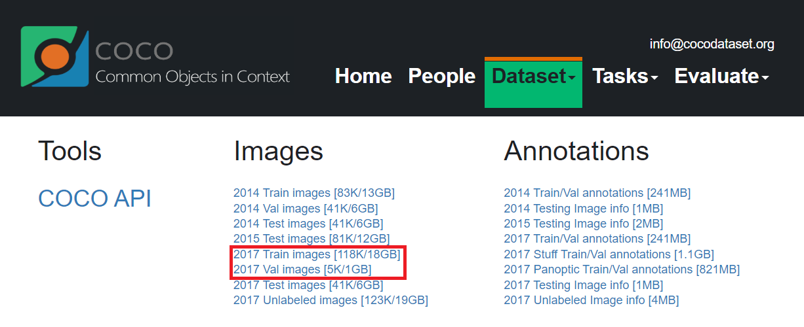

# **MediaPipe Object Detection Model Machine Learning**

The reason we used the Object detection model customization guide is to create a TensorFlow Lite to load into the app.

Colab was used to create a MediaPipe object detection model.
<br/><br/>
## 1. **Setup**

Install Python to use MediaPipe in Colab.

```python
python --version
pip install --upgrade pip
pip install mediapipe-model-maker
```
<br/>
Check the version of python, upgrade the pip to the latest, and install the required python package.

```python
from google.colab import files
import os
import json
import tensorflow as tf
assert tf.__version__.startswith('2')

from mediapipe_model_maker import object_detector
```

Import the required library from Python and check the version of TensorFlow.

(If the TensorFlow version does not start with 2, AssignmentError will occur.)
<br/><br/>
## 2. **Prepare data**

**Prepare the data set and store the data set in the directory location.** <br/> <br/>

We get the dataset from the coco site, and refer to the github repository below for labels.

Link : https://cocodataset.org/#download



github link : https://github.com/daved01/cocoTraffic

The image was acquired by downloading the ‘train2017.zip’ file and the ‘val2017.zip’ file from the coco website. And through the ‘02_coco_traffic.zip file’, we tried to analyze vehicle and pedestrian data such as 'traffic light', 'car', 'truck', 'bus', and 'motorcycle'.
(The json file exists in the ‘02_coco_traffic.zip file’) <br/> <br/>

Subset of the ‘train2017’ images with classes which are related to traffic, and all traffic light images from ‘val2017’. These images have been split into a training and validation set (split 80/20). <br/> <br/>

We prepared a total of 124,000 photos and data from labels files through the above data.

- Train 2017 (18G) : 120,000 photos
    
    Train Labels.json : 150mb
    

- Val2017 (1G) : 4,000 photos
    
    Val Labels.json : 75mb <br/> <br/>
    

### 2.1 Google Drive interlocking
(The data set was stored on Google Drive and then mounted)

```
from google.colab import drive
drive.mount('/content/drive/')
```

.png)

### **2.2 Pathing the Learning Dataset**

Store the directory locations in train_dataset_path and validation_dataset_path, respectively.

```
!unzip "/content/drive/MyDrive/train.zip"

train_dataset_path = "train"
validation_dataset_path = "validation"
```

Each train and validation dataset follows the COCO dataset format described below.
<br/>The Model Maker object detection API supports reading the following data set formats.
<br/> <br/>
The COCO dataset format has a `data` directory which stores all of the images and a single `labels.json` file which contains the object annotations for all images.

```
<dataset_dir>/
  data/
    <img0>.<jpg/jpeg>
    <img1>.<jpg/jpeg>
    ...
  labels.json
```
<br/> <br/>
where `labels.json` is formatted as:

```
{
  "categories":[
    {"id":1, "name":<cat1_name>},
    ...
  ],
  "images":[
    {"id":0, "file_name":"<img0>.<jpg/jpeg>"},
    ...
  ],
  "annotations":[
    {"id":0, "image_id":0, "category_id":1, "bbox":[x-top left, y-top left, width, height]},
    ...
  ]
}
```

We used the COCO format, but we can also use the PASCAL VOC format.

To use the PASCAL VOC format, see the first link in Full References at the end of this article. <br/> <br/>

## 3. Review dataset

**Verify the dataset content by printing the categories from the `labels.json` file.** 
There should be 3 total categories.

```
with open(os.path.join(train_dataset_path, "labels.json"), "r") as f:
  labels_json = json.load(f)
for category_item in labels_json["categories"]:
  print(f"{category_item['id']}: {category_item['name']}")
```

Our label has the following categories.
<br/>
(Labels provided by coco and additional categories added by cocotrafic are available. There are 3 labels we have added.)
<br/> <br/>
Label categories provided by coco : 
https://storage.googleapis.com/mediapipe-tasks/object_detector/labelmap.txt
<br/> <br/>
3 categories we added :

```
'traffic_light_red'
'traffic_light_green'
'traffic_light_na'
```

.png)
<br/> <br/>
## 4. Create dataset

How to load a coco dataset into a Dataset class:

- `Dataset.from_coco_folder`

When loading the dataset, the data will be parsed from the provided path and converted into a standardized [TFRecord](https://www.tensorflow.org/tutorials/load_data/tfrecord) format which is cached for later use. <br/>
You should create a `cache_dir` location and reuse it for all your training to avoid saving multiple caches of the same dataset.

```
train_data = object_detector.Dataset.from_coco_folder(train_dataset_path, cache_dir="/tmp/od_data/train")
validation_data = object_detector.Dataset.from_coco_folder(validation_dataset_path, cache_dir="/tmp/od_data/validation")
print("train_data size: ", train_data.size)
print("validation_data size: ", validation_data.size)
```

### Result

.png)

**train_data size : 11544**

**validation_data size : 2887**
<br/> <br/>
## 5. Set retraining options

There are a few required settings to run retraining aside from your training dataset: output directory for the model, and the model architecture. <br/>
Use `HParams` to specify the `export_dir` parameter for the output directory. <br/>
Use the `SupportedModels` class to specify the model architecture. The object detector solution supports the following model architectures:

- `MobileNet-V2`
- `MobileNet-MultiHW-AVG`
<br/>

For more advanced customization of training parameters, see the [Hyperparameters](https://developers.google.com/mediapipe/solutions/customization/object_detector#hyperparameters) section below.

To set the required parameters, use the following code:

```
spec = object_detector.SupportedModels.MOBILENET_MULTI_AVG
hparams = object_detector.HParams(export_dir='exported_model')
options = object_detector.ObjectDetectorOptions(
    supported_model=spec,
    hparams=hparams
)
```
<br/> <br/>
## 6. Run retraining

**With your training dataset and retraining options prepared, you are ready to start the retraining process. This process is resource intensive and can take a few minutes to a few hours depending on your available compute resources.**

```
model = object_detector.ObjectDetector.create(
    train_data=train_data,
    validation_data=validation_data,
    options=options)
```

We initially used a free T4 GPU from Colab. We had to run a total of 30 Epochs and the T4 GPU took 210 minutes. But after 210 minutes, we had a runtime error.
<br/> <br/>
The picture below is a 'Runtime connection disconnected' warning we've experienced.

.png)

To solve the runtime error, we used the A100 GPU with a long runtime among the paid versions provided by colab. The A100 GPU took 120 minutes to run 30 epoches, and even after Run retraining, the runtime connection did not break and operated normally.

Here is a link to the data comparing the T4 GPU with the A100 GPU. <br/>
https://www.topcpu.net/en/gpu-c/tesla-t4-vs-a100-pcie
<br/> <br/>
## 7. E**valuate the model performance**

After training the model, evaluate it on validation dataset and print the loss and coco_metrics. 
The most important metric for evaluating the model performance is typically the "AP" coco metric for Average Precision.

```
loss, coco_metrics = model.evaluate(validation_data, batch_size=4)
print(f"Validation loss: {loss}")
print(f"Validation coco metrics: {coco_metrics}")
```

<br/> <br/>
## 8. **Export model**

**This is the last step, and you can get the tflite file that we want through this process.**
<br/> <br/>
After creating the model, convert and export it to a Tensorflow Lite model format for later use on an on-device application. The export also includes model metadata, which includes the label map.

```
model.export_model()
!ls exported_model
files.download('exported_model/model.tflite')
```

### Result
[model.tflite](https://prod-files-secure.s3.us-west-2.amazonaws.com/f3399cc4-3fba-41b7-b0c4-bf63f4ec904b/cea42994-3c32-47a0-98c7-2fecc1b3020f/model.tflite)

---
<br/> <br/>
## Full References

> https://developers.google.com/mediapipe/solutions/customization/object_detector
> 
> https://cocodataset.org/#download
> 
> https://github.com/daved01/cocoTraffic
> 
> https://www.topcpu.net/ko/gpu-c/tesla-t4-vs-tesla-v100-pcie-16-gb?lang
